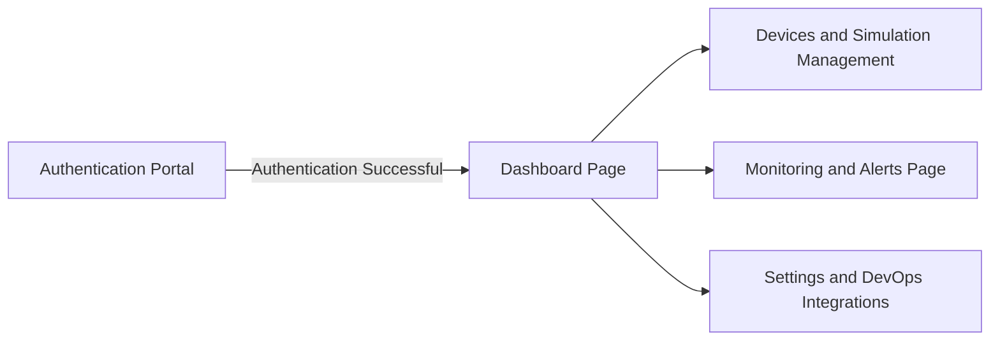
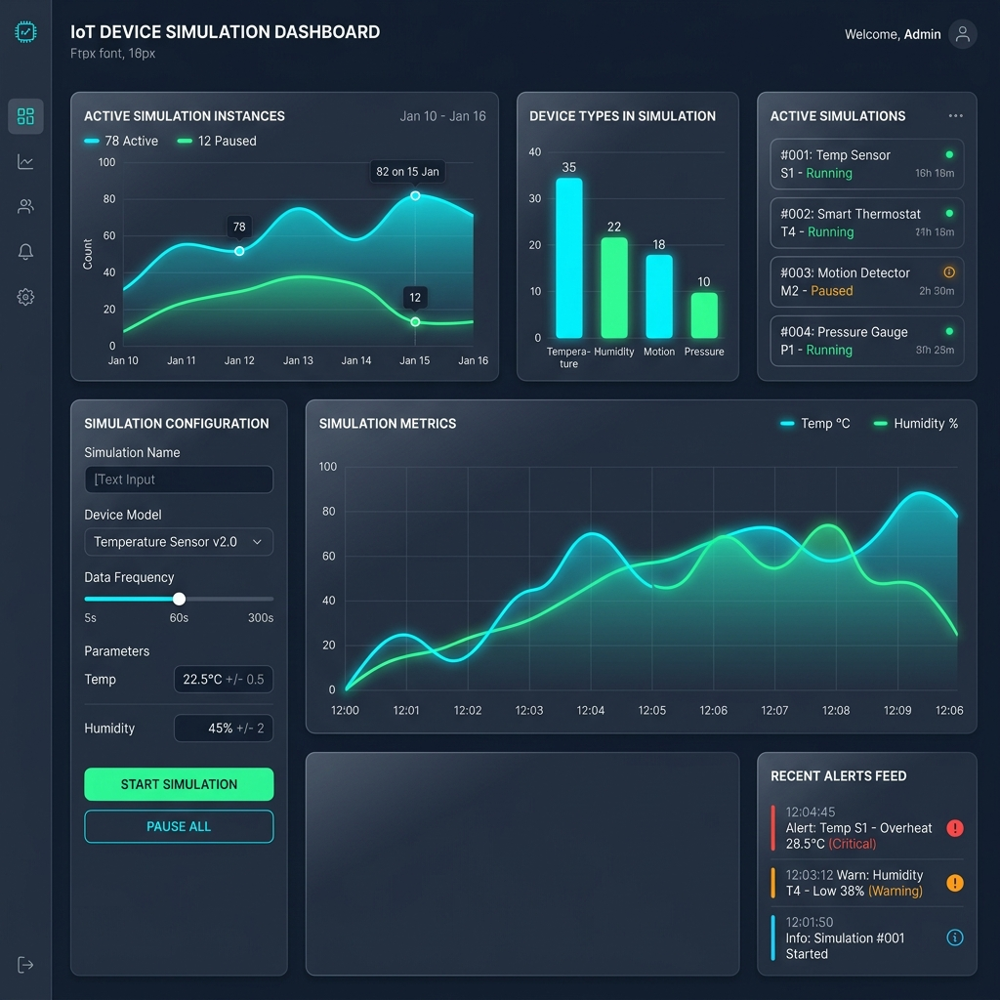
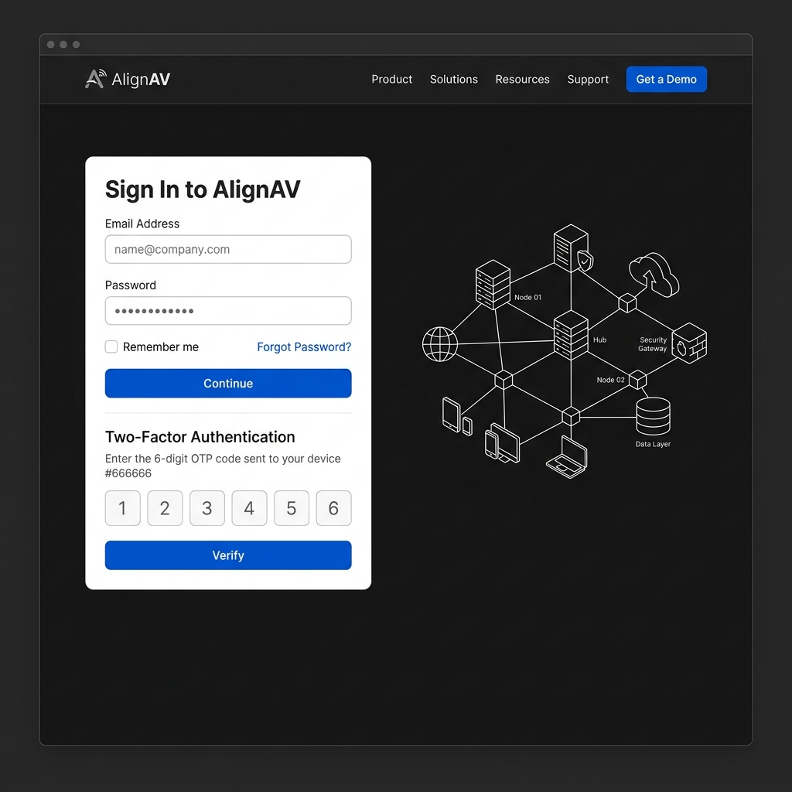
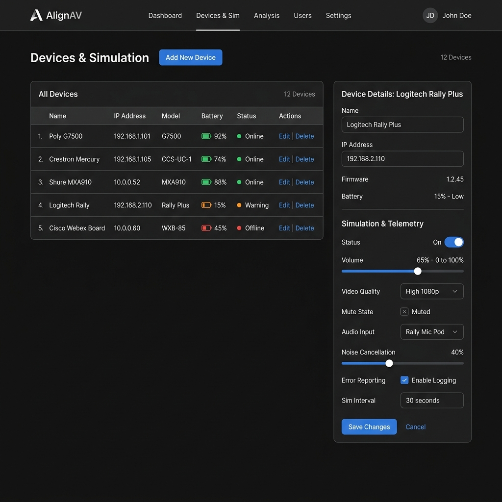
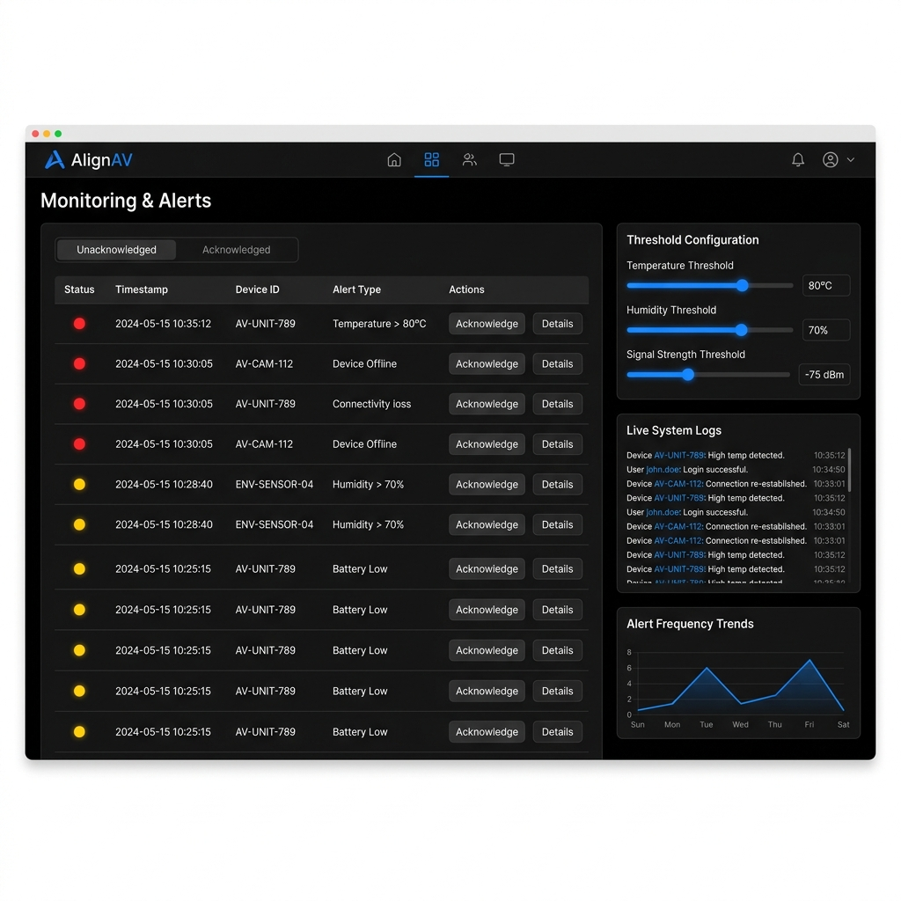
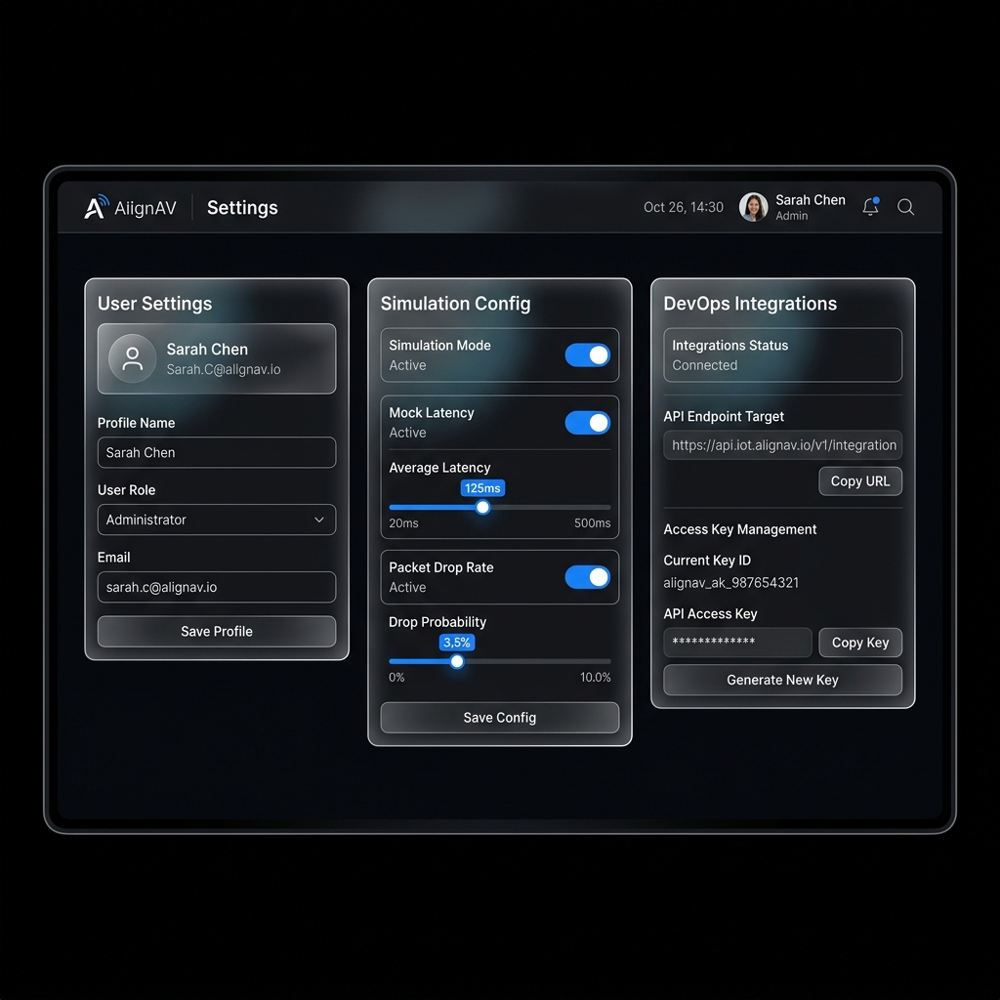

# AlignAV: IoT Device Simulation and Monitoring Dashboard Design Document
## Sprint 0 Deliverable: Standardized Flat Realistic Web UI Mockups

This design document showcases the standardized high-fidelity desktop UI layouts and wireframes for the AlignAV platform. All pages are designed with a uniform solid black/dark gray background, standard web design components (tables, card lists, rectangular inputs, flat button styles), and clear AlignAV branding.

---

## Global UI Design System and Identity

* **Project Brand**: AlignAV (displays in top header area alongside standard sans-serif nav menus)
* **Base Canvas**: Uniform solid dark gray-black background (#0b0c10 to #121212) for visual consistency and premium contrast.
* **Components**: Flat, solid card layouts with light border edges (#1f2937 or #2d3748), avoiding abstract glowing blobs or sci-fi ambient overlays.
* **Controls**: Clean rectangular inputs, standard buttons with solid fills (e.g. blue action keys #2563eb), simple toggle switches, and standard progress-bar sliders.
* **Typography**: Primary font family is Inter or standard sans-serif. Monospace typography is used for logs, console text, and code snippets.
* **Spacing**: 8px layout grid spacing system (padding/margins are multiples of 8px).

---

## Workspace Navigation Flow

The application routing is defined by a standard sidebar layout linked to the central authentication flow.



---

## Screen Mockup Artifacts

The following section presents the high-fidelity flat mockup screenshots and wireframes for each view in the AlignAV application.

> [!NOTE]
> All images have been successfully transferred to the active session workspace for display. The updated text specifications below govern the final implementation details.

```carousel

<!-- slide -->

<!-- slide -->

<!-- slide -->

<!-- slide -->

<!-- slide -->

<!-- slide -->

```

---

## Wireframe Layout Structure

To ensure UI alignment across all implemented pages, the following diagrams represent the responsive grid structures.

### Dashboard Layout Wireframe Grid

```
+---------------------------------------------------------------------------------+
| AlignAV [Header Logo]        [Search Input...]                  [Profile Drop]  |
+---------------------------------------------------------------------------------+
| (Nav Menu) |  +--------------+  +--------------+  +--------------+  +---------+ |
| Dashboard  |  | Total        |  | Online       |  | Offline      |  | Active  | |
|            |  | 24           |  | 20           |  | 4            |  | 2       | |
| Devices    |  +--------------+  +--------------+  +--------------+  +---------+ |
|            |  +---------------------------------------------------------------+ |
| Alerts     |  | Telemetry Graph Area                                          | |
|            |  | [ Spline chart tracking temperature and humidity metrics ]    | |
| Settings   |  +---------------------------------------------------------------+ |
|            |  +-----------------------------+ +-------------------------------+ |
| [Log Out]  |  | Recent Activity Feed        | | Device Category Grid          | |
|            |  | [Table: Time/Device/Event]  | | [Sensors, Gateways, Displays] | |
|            |  +-----------------------------+ +-------------------------------+ |
+------------+--------------------------------------------------------------------+
```

### Devices and Simulation Wireframe Grid

```
+---------------------------------------------------------------------------------+
| AlignAV [Header Logo]        [Search Input...]                  [Profile Drop]  |
+---------------------------------------------------------------------------------+
| (Nav Menu) |  +---------------------------------------------------------------+ |
| Dashboard  |  | Device Inventory Table                                        | |
|            |  | [Table: Name, IP Address, Model, Battery status, Action links]| |
| Devices    |  +---------------------------------------------------------------+ |
|            |  +-----------------------------+ +-------------------------------+ |
| Alerts     |  | Simulation Control Deck     | | Live Console Output           | |
|            |  | - Run/Pause Simulation       | | - Telemetry logs (monospaced) | |
| Settings   |  | - Temp/Humidity Sliders     | | - Log scrollable area         | |
|            |  | - Parameter dropdowns       | |                               | |
|            |  +-----------------------------+ +-------------------------------+ |
+------------+--------------------------------------------------------------------+
```

---

## Detailed Screen Specifications

### 1. Dashboard Page
* **Header**: Left-aligned AlignAV logo, center search utility, and right profile dropdown with active system status.
* **Top Row Statistics**: Detailed cards for Total Devices, Online, Offline, and Alerts with matching borders.
* **Sensor Telemetry Graph**: A wide-screen dual-spline chart tracking Temperature and Humidity metrics over a clean grid backdrop.
* **Category Grid**: Visual quick-link list for categorized device types (Sensors, Gateways, Displays, Lighting, Climate, Security, Audio).
* **Recent Activity Log**: Responsive tabular feed recording system-wide events and action triggers.

### 2. Authentication Portal (Sign In Only)
* **Login Credentials Card**: Form card with clean inputs for Email Address, Password, and a prominent solid blue Continue button.
* **OTP and 2FA Section**: The two-factor authentication (OTP) inputs have been removed from the access flow to simplify login.
* **Network Diagram**: Simple white line-art graphic displaying system topography and node links on a solid black canvas.

### 3. Devices and Simulation Management
* **Device Grid Table**: Clean table layout listing device inventory metadata (Name, IP Address, Model, Battery level status indicator) and links for Edit and Delete.
* **Simulation Control Deck**: Solid toggle buttons, linear sliders to customize temp/humidity limits, and parameter settings dropdown fields.
* **Live Activity Console**: Embedded console logging messages directly from simulated sensors.

### 4. Monitoring and Alerts Page
* **Alert Feed**: Detailed alert tables splitting unacknowledged and acknowledged warnings, highlighting severity colors (Red: Critical, Yellow: Warning, Blue: Info).
* **Threshold Toggles**: Blue sliders setting critical alert trigger points.
* **Alert Frequency Trends**: A daily area chart tracking system anomaly frequencies.

### 5. Settings and DevOps Integrations
* **Style**: Standardized browser outer window frame, solid black-gray background, and flat gray border lines to match the Alerts page.
* **Profile Configuration**: User preferences, profile name, profile image, and dropdown selection for roles (Administrator, Editor, Viewer).
* **Simulation Network Mocking**: Configurable switches for mock latency and packet drops with sliders to configure precise latency limits.
* **DevOps integrations**: Target API endpoints and Access Key Generation utilities featuring copy buttons.

---

## Interaction and State Transitions

To ensure a cohesive and fluid user experience, the frontend application follows these interaction patterns:

* **Hover States**: All buttons, links, and navigation items transition smoothly over 150ms. Hovering cards subtly shifts border colors to a lighter gray or primary blue rather than scaling or shifting position.
* **Active and Focused Fields**: Form inputs highlight with a solid border color change (no ambient outer glow) to maintain a flat, structured aesthetic.
* **Disabled Controls**: Interactive components in an inactive or disabled state receive a 50% opacity styling with a disabled cursor status.
* **Real-Time Data Streaming**: Graph points and log lists append data incoming from the WebSocket service without visual layout shifting or page jumping.

---

## Front-End Developer Technical Implementation Guidelines

1. **State Management**: Use Zustand for client state management, splitting the state into isolated slices (Device, Alert, Simulation, Theme, Auth) for maximum modularity.
2. **Styling and Layout**: Use Tailwind CSS for standard layout configuration. Avoid styling utilities outside of predefined tailwind classes to maintain consistency.
3. **Data Communication**: Integrate raw mock API queries with a persistent mock WebSocket provider to handle live events and metric broadcasts.
